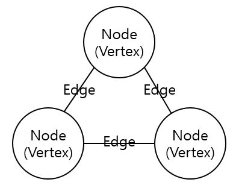

# 탐색 알고리즘 : DFS / BFS

스택, 큐, 재귀 함수는 DFS 와 BFS 에서 가장 중요한 개념이다.

## DFS(Depth-First Search) : 깊이 우선 탐색

DFS 는 깊이 우선 탐색이라고 부르며, 그래프에서 깊은 부분을 우선적으로 탐색하는 알고리즘이다.

### 그래프(Graph)의 기본 구조



- __Graph__
  - Node(Vertex, 정점)
  - Edge(간선)
- __그래프 탐색이란?__
  - 하나의 노드를 시작으로 다수의 노드를 방문하는 것
- __인접(Adjacent)__
  - 두 노드가 간선으로 연결되어 있는 경우

### 그래프를 표현하는 방법

프로그래밍에서는 그래프를 크게 2가지 방식으로 표현할 수 있다.


- __인접 행렬(Adjacent Matrix)__
  - 2차원 배열로 그래프의 연결 관계를 표현하는 방식
- __인접 리스트(Adjacent List)__
  - 리스트로 그래프의 연결 관계를 표현하는 방식

#### 인접 행렬(Adjacent Matrix)

```java
public class Main {

    // 연결이 되어 있지 않는 노드끼리는 무한(Infinity)의 비용이라고 작성
    private static final int INF = Integer.MAX_VALUE;
    
    // 2차원 배열 이용해 인접 행렬 표현
    private static int[][] graph = {
        {0, 7, 5},
        {7, 0, INF},
        {5, INF, 0}
    };

    public static void main(String[] args) {
        // 그래프 출력
        for (int i = 0; i < 3; i++) {
            for (int j = 0; j < 3; j++) {
                System.out.print(graph[i][j] + " ");
            }
            System.out.println();
        }
    }
}
```

#### 인접 리스트(Adjacent List)

```java
class Node {

    private int index;
    private int distance;

    public Node(int index, int distance) {
        this.index = index;
        this.distance = distance;
    }

    public void show() {
        System.out.print("(" + this.index + "," + this.distance + ") ");
    }
}

public class Main {

    // 행(Row)이 3개인 인접 리스트 표현
    public static ArrayList<ArrayList<Node>> graph = new ArrayList<ArrayList<Node>>();

    public static void main(String[] args) {
        // 그래프 초기화
        for (int i = 0; i < 3; i++) {
            graph.add(new ArrayList<Node>());
        }

        // 노드 0에 연결된 노드 정보 저장 (노드, 거리)
        graph.get(0).add(new Node(1, 7));
        graph.get(0).add(new Node(2, 5));

        // 노드 1에 연결된 노드 정보 저장 (노드, 거리)
        graph.get(1).add(new Node(0, 7));

        // 노드 2에 연결된 노드 정보 저장 (노드, 거리)
        graph.get(2).add(new Node(0, 5));

        // 그래프 출력
        for (int i = 0; i < 3; i++) {
            for (int j = 0; j < graph.get(i).size(); j++) {
                graph.get(i).get(j).show();
            }
            System.out.println();
        }
    }
}
```
