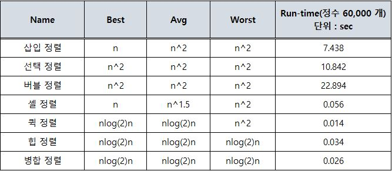

# 정렬(Sorting)

# 선택 정렬(Selection Sort)

Point. 최솟값을 찾아 정렬되지 않은 가장 앞에 존재하는 원소와 교체(swap)하는 알고리즘 : `1회전마다 최솟값을 앞으로 보내는 알고리즘`

- __제자리 정렬(in-place sorting) 알고리즘의 하나__
  - 입력 배열(정렬되지 않은 값들) 이외에 다른 추가 메모리를 요구하지 않는 정렬 방법
- __해당 순서에 원소를 넣을 위치는 이미 정해져 있고, 어떤 원소를 넣을지 선택하는 알고리즘__
  - 첫 번째 순서에는 첫 번째 위치에 가장 최솟값을 넣는다.
  - 두 번째 순서에는 두 번째 위치에 남은 값중에서의 최솟값을 넣는다.
- __과정 설명__
  1. 주어진 배열 중에서 최솟값을 찾는다.
  2. 그 값을 맨 앞에 위치한 값과 교체한다(패스(pass))
  3. 맨 처음 위치를 뺀 나머지 리스트를 같은 방법으로 교체한다.
  4. 하나의 원소만 남을 때까지 위의 과정을 반복한다.
- __구체적인 개념__
  - 선택 정렬은 첫 번째 자료를 두 번째 자료부터 마지막 자료까지 차례대로 비교하여 `가장 작은 값(최솟값)`을 찾아 첫 번째에 놓고, 두 번째 자료를 세 번째 자료부터 마지막 자료까지와 차례대로 비교하여 그 중 가장 작은 값을 찾아 두 번째 위치에 놓는 과정을 반복하며 정렬을 수행한다.

# 버블 정렬(Bubble Sort)

Point. 서로 인접한 두 원소를 검사하여 정렬하는 알고리즘 : `1회전 마다 최댓값을 맨 뒤로 보내는 알고리즘`

- __서로 인접한(adjacent) 두 원소를 검사하여 정렬하는 알고리즘__
   - 인접한 2개의 레코드를 비교하여 크기가 순서대로 되어 있지 않으면 교환한다.
   - 선택 정렬과 기본 개념이 유사하다.
- __구체적인 개념__
  - 버블 정렬은 첫 번째 자료와 두 번째 자료를, 두 번째 자료와 세 번째 자료를, 세 번째와 네 번째를, … 이런 식으로 (마지막-1)번째 자료와 마지막 자료를 비교하여 교환하면서 자료를 정렬한다.
  - `1회전을 수행하고 나면 가장 큰 자료가 맨 뒤로 이동`하므로 2회전에서는 맨 끝에 있는 자료는 정렬에서 제외되고, 2회전을 수행하고 나면 끝에서 두 번째 자료까지는 정렬에서 제외된다. 이렇게 정렬을 1회전 수행할 때마다 정렬에서 제외되는 데이터가 하나씩 늘어난다.

## Reference

> https://gmlwjd9405.github.io
